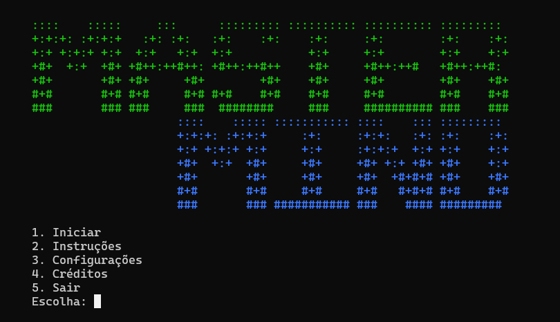

# mastermind



**mastermind** é uma implementação do jogo [Mastermind](https://pt.wikipedia.org/wiki/Mastermind),
ou Senha, como é conhecido no Brasil. Foi feito como trabalho final da disciplina Computação I do
Bacharelado em Ciência da Computação da UFRJ. Instruções sobre como jogar o jogo estão disponíveis
no programa.

O grupo responsável pelo desenvolvimendo do jogo é composto por:

- [Erick Gaiote](https://github.com/EkEgg) (eu);
- [Gabriel Duarte](https://github.com/dsgab);
- [João Pedro Souza](https://github.com/jodopodro).

## Compilação

Para compilar o programa, basta executar:

### Linux

```
./build
```

### Windows

```
./winbuild
```

### Compilação manual
```
gcc main.c telas/*.c utilidades/*.c fluxos/*.c -o mastermind -ansi -pedantic -Wall -O3
```

## Uso

Para usar o programa, basta executar:

### Linux

```
./mastermind
```

### Windows

```
./winrun
```
